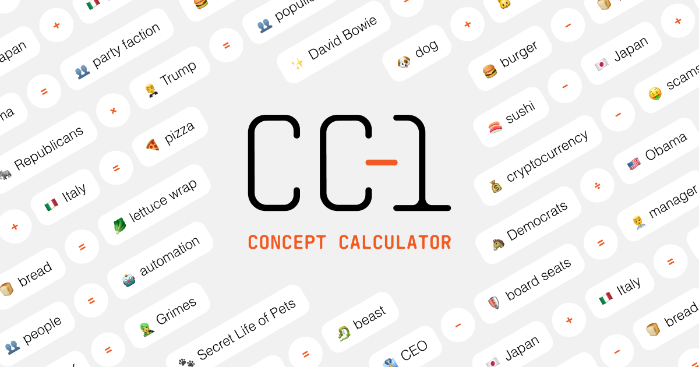

# Concept Calculator Project

Welcome to the Concept Calculator project, a unique tool designed to perform semantic operations on conceptual words. This project leverages the power of natural language processing and machine learning to enable users to manipulate and transform concepts in a logical and meaningful way.

## Project Overview

The Concept Calculator is built around a set of predefined operations that can be applied to conceptual words. These operations include addition (+), subtraction (-), multiplication (×), and division (÷). Each operation has a distinct effect on the input concepts, allowing users to create new concepts, modify existing ones, or break them down into smaller components.

The project's core functionality is based on a set of rules and guidelines that ensure the operations produce logical and coherent results. For example, adding two concepts might result in a new concept that combines the best traits of both, while subtracting a trait might lead to a diminished or simplified version of the original concept.

## Key Features

* **Semantic Operations**: Perform addition, subtraction, multiplication, and division on conceptual words to create new concepts or modify existing ones.
* **Conceptual Word Manipulation**: Apply operations to words to change their meaning, scope, or complexity.
* **Logical Results**: The project ensures that the results of operations are logical, coherent, and follow a set of predefined rules.
* **Emoji Representation**: The project includes an emoji generator that suggests a single emoji to represent the resulting concept, making it easier to visualize and understand the outcome.

## Technical Details

The Concept Calculator project is built using Node.js, Express.js, and the OpenAI API. It leverages the OpenAI GPT-4o-mini model for natural language processing and machine learning capabilities. The project also utilizes CORS for secure and controlled access to the API.

## Getting Started

To get started with the Concept Calculator project, follow these steps:

1. Clone the repository to your local machine.
2. Install the required dependencies using `npm install`.
3. Start the server using `node server.js`.
4. Use a tool like Postman or cURL to send requests to the API endpoints.

## API Endpoints

The project exposes two API endpoints:

* `/api/openai/concept-calculator`: This endpoint accepts a JSON payload with a list of messages, including the operation and concepts to be manipulated. It returns the result of the operation as a JSON object.
* `/api/openai/emoji-generator`: This endpoint accepts a JSON payload with a message describing the concept to be represented by an emoji. It returns a JSON object with a single emoji that best represents the concept.

## Contributing

The Concept Calculator project is open to contributions and suggestions. If you're interested in contributing, please fork the repository, make your changes, and submit a pull request.

## License

The Concept Calculator project is licensed under the MIT License.
